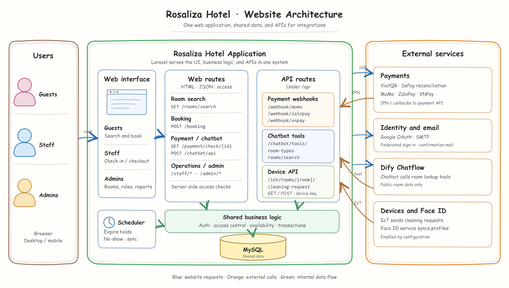

# Rosaliza Hotel

Rosaliza Hotel is a hotel booking and operations website. It runs as a **Laravel monolith**: one Laravel application serves the guest, receptionist, and administrator interfaces, handles business rules and API endpoints, and stores operational data in MySQL.

## Features

| Area | Capabilities |
| --- | --- |
| Guests | Account registration and sign-in, email OTP, room search, booking, payment, booking history, cancellation, stay extension, reviews, and concierge chat. Google sign-in is available when OAuth is configured. |
| Receptionists | Room map, reservations, QR check-in, checkout, counter payments, extensions, cancellations and refunds, and cleaning requests. Server-side permissions govern each operation. |
| Administrators | Dashboard and reports, rooms and room types, amenities, seasonal pricing, internal accounts, roles, and permissions. |

## Architecture



The web interfaces and `/api` endpoints belong to the same Laravel application and use the same MySQL database. Payment providers, email, Google OAuth, Dify, Face ID, and IoT devices connect through configured integrations. See the [architecture notes](docs/ARCHITECTURE_SKETCH.md) and the [editable SVG](docs/architecture-sketch.svg).

## Technology

| Layer | Technology |
| --- | --- |
| Backend | PHP 8.2+, Laravel 12, Eloquent |
| UI | Blade, Vue 3 components, Vite, Tailwind CSS 4 |
| UI libraries | GSAP, Lenis, Chart.js, html5-qrcode |
| Data | MySQL; Laravel database sessions |
| Integrations | Google Socialite, SMTP, VietQR/SePay, MoMo, ZaloPay, VNPay, Dify, Face ID, IoT |

## Repository structure

```text
app/
  Console/              Scheduled and command-line tasks
  Http/                 Controllers and middleware for web and API requests
  Mail/                 Transactional email classes
  Models/               Eloquent models
  Providers/            Laravel service providers
  Services/             Booking, payment, chatbot, and Face ID logic
bootstrap/              Application bootstrap and middleware registration
config/                 Application and integration configuration
database/
  migrations/           Schema history
  seeders/              Local sample data and internal accounts
  qlkhachsan.sql        MySQL snapshot included in the repository
docs/                   Project documents and architecture diagram
face_recognition/
  pc/                   Face ID companion service for PC
  pi/                   Face ID companion service for Raspberry Pi
ops/dify/               Dify tool router and integration configuration
public/                 Web entry point and public assets
resources/
  css/                  Application styles
  js/                   Vue components and browser scripts
  knowledge/            Hotel knowledge used by the chatbot
  views/                Blade templates for guest, staff, and admin pages
routes/
  web.php               Browser and session routes
  api.php               Payment, chatbot-tool, and IoT endpoints
  console.php           Scheduled task definitions
tests/
  Feature/              Application feature tests
  Unit/                 Unit tests
```

`vendor/`, `node_modules/`, runtime storage, `.env`, and built assets are local or generated and are not needed in the repository. The committed `.env.example` provides configuration names without credentials.

## Requirements

- PHP 8.2 or newer with Composer
- MySQL
- Node.js and npm

## Local setup

1. Install PHP dependencies and create a local environment file:

   ```bash
   composer install
   cp .env.example .env
   php artisan key:generate
   ```

   In PowerShell, use `Copy-Item .env.example .env` instead of `cp` if preferred. Configure `APP_URL`, the MySQL connection, and `SESSION_DRIVER=database` in `.env`. Add provider credentials only for integrations you intend to use.

2. Initialize **one** database path:

   - For a new empty database, run `php artisan migrate --seed`. Set `LOCAL_ADMIN_PASSWORD` and `LOCAL_STAFF_PASSWORD` in `.env` before seeding. Never use demo passwords on a public deployment.
   - To use the included snapshot, import `database/qlkhachsan.sql` into an empty MySQL database once, then run `php artisan migrate` and `php artisan db:seed --class=RoomCapacitySeeder`. Do not run the full `DatabaseSeeder` after importing the snapshot, or overwrite a database with operational data.

3. Install and build frontend assets, then start the local processes:

   ```bash
   npm ci
   npm run build
   composer dev
   ```

   `composer dev` applies pending migrations, then starts the Laravel server, queue listener, log viewer, scheduler, and Vite. The default local URL is `http://127.0.0.1:8000`. `composer start` runs only the server after applying pending migrations; it does not start the scheduler. Expiring payment holds and no-show bookings require the scheduler.

## Data and booking behavior

- Room search and booking validation run on the server, including stay dates, capacity, and availability.
- A booking retains its room assignment, stay dates, and price at the time of booking. Later room price changes do not rewrite historical booking amounts.
- Payment results and booking status changes are reconciled in the backend. Expired payment holds and missed check-ins are handled by scheduled jobs.
- Guest, receptionist, and administrator screens read from the same operational database. Internal actions are checked against server-side permissions.
- The chatbot can use hotel knowledge for stable information; current prices and availability come from Laravel room lookup tools.

## External integrations

| Integration | Purpose | Configuration needed |
| --- | --- | --- |
| Google OAuth | Guest sign-in | Client ID, client secret, callback URL |
| SMTP | OTP and transactional email | Valid `MAIL_*` settings |
| VietQR / SePay | Bank transfer QR and transaction reconciliation | Receiving account and SePay configuration |
| MoMo, ZaloPay, VNPay | Hosted payment flows and provider callbacks | Provider credentials and reachable callback/IPN URLs |
| Dify | Concierge conversation and room lookup tools | Server-side API configuration and tool secret |
| Face ID / IoT | Companion services and cleaning request devices | Service endpoints and device credentials |

Integration code does not imply that live payment processing is enabled. Live use requires valid provider credentials and working callback or reconciliation configuration.

## Verification

```bash
php artisan test --compact
npm run build
php artisan view:cache
```

## Security and deployment

Keep `.env` and all provider secrets outside Git. Configure HTTPS, secure cookies, and `APP_DEBUG=false` for a public deployment. Use unique internal account passwords. Payment callbacks and chatbot/IoT endpoints must use the configured provider verification or API credentials.

## Further reading

- [Architecture diagram and API flows](docs/ARCHITECTURE_SKETCH.md)
- [Project rules and workflows](docs/PROJECT_RULES_AND_SKILLS.md)
- [RAG architecture](docs/RAG_ARCHITECTURE.md)
- [Dify integration](ops/dify/README.md)
- [Google OAuth setup](docs/GOOGLE_OAUTH_SETUP.md)
- [Security audit](docs/SECURITY_AUDIT.md)
